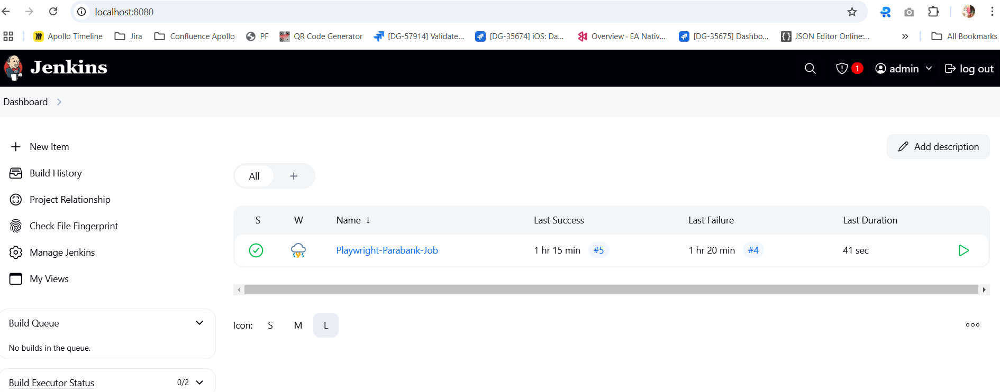
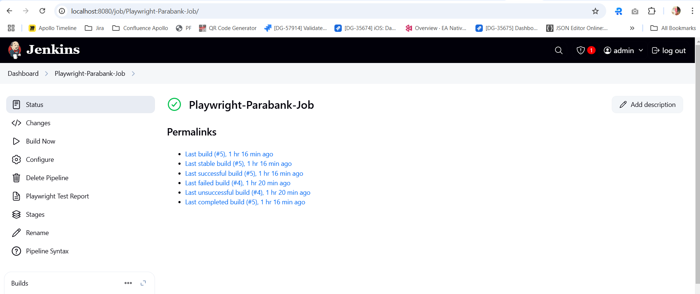
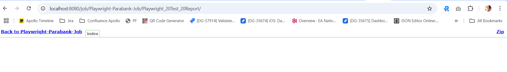
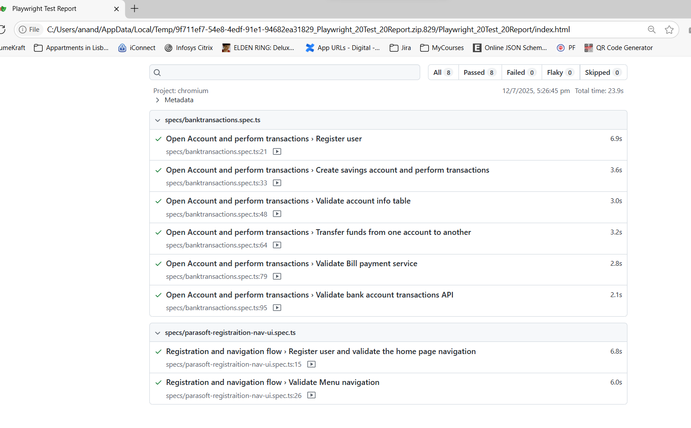

# Scenario Coverage

Test scenarios covered are under /tests/specs folder
2 Specs files are available
1. parasoft-registraition-nav-ui.spec.ts
    This covers the registration and sanity navigation through the app while varifying objects in each page
2. banktransactions.spec.ts
    This includes registering the user and all the transaction related flows
    2.1 Create Savings Account
    2.2 Validation of Account balance
    2.3 Transfering funds
    2.4 Bill Payment flow
    2.5 API validation of the transactions performed

# High level Project Structure

parabank/
├── resources/  
│   ├── displayTextConstants/  
│   │   └── < Page based JSON files >.json  
│   ├── testdata/  
│   │   └── < Spec based JSON file >.json  
│   └── test-results/  
├── tests/  
│   ├── pages/  
│   │   ├── < Page based Folders >  
│   │   │   ├── < Page Object >.object.ts  
│   │   │   └── < Page Reusable methods >.page.ts  
│   └── specs/  
│       └── < Spec files which has the test scenarios >  
├── utils/  
├── .gitignore  
├── Jenkinsfile  
├── package-lock.json  
├── package.json  
├── playwright.config.ts  
└── tsconfig.json  

In the Above structure
1. displayTextConstants has the static text which are displayed in each page. This is used as the expected values for assertions
2. testdata folder has the data used for each test/scenario
3. Test folder has page folder, specs folder and utils folder
4. page folder has the objects for each page and the reusable methods used in each of these page
5. specs floder has the test scenarios
6. utils folder has the framework level actions like clicking validations and loging related methods
7. Jenkinsfile has the config and groovy commands to run in Jenkins
8. playwright.config.ts has the playwright related configuration

# Execution

Before making the execution make sure that the node versions are installed

run *npm install* to install all the package dependencies

run  *npx playwright install* to install the browser configurations of playwright

run *npx playwright test* to run the test

# Execution Video of Screen recording is available on project level under name ExecutionVideoReducedSize.mp4  

# Sample Screenshots

**Jenkins Execution**
  
  
  

